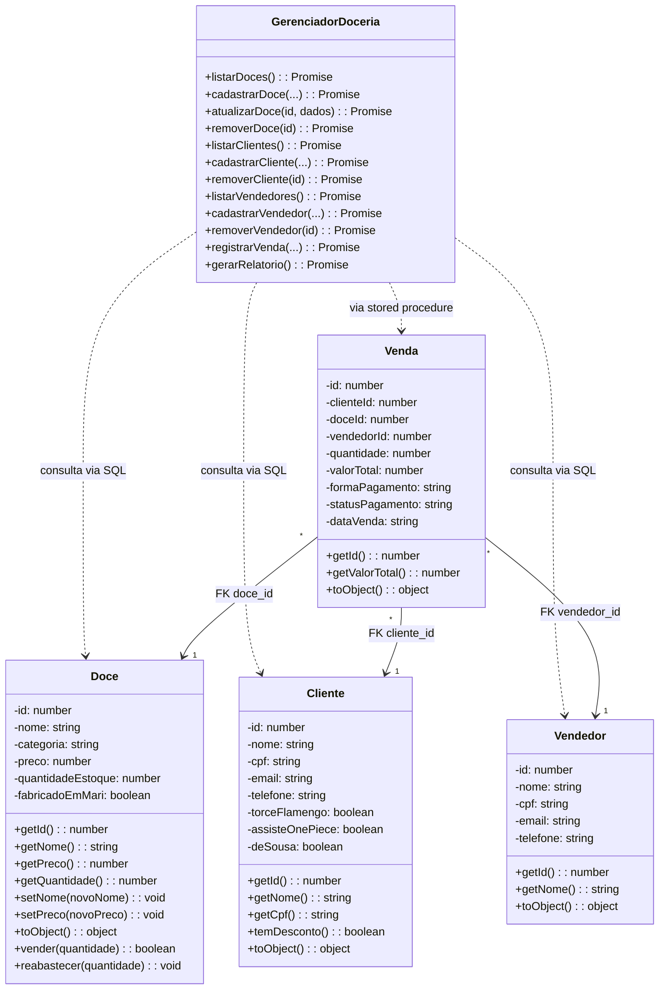

# Doceria Gourmet

Sistema web para gerenciamento de uma doceria com areas separadas para **cliente** e **administrador**. Clientes navegam o catalogo e compram doces com desconto automatico. Administradores gerenciam doces, clientes, vendedores, vendas e relatorios.

**Stack:** Next.js 16 + React 19 + TypeScript + Tailwind CSS 4 + shadcn/ui + PostgreSQL 16

---

## Como Executar

Veja o guia completo em [`docs/public/COMO-RODAR.md`](docs/public/COMO-RODAR.md).

Resumo rapido:

```bash
npm install
docker compose up -d        # sobe o PostgreSQL
node scripts/migrate.mjs    # aplica migrations (se banco ja existia)
npm run dev
# acesse http://localhost:3303
```

---

## Paginas

Na tela inicial (`/`) o usuario escolhe entre **Cliente** e **Administrador**.

**Area do Cliente:**

| Pagina | Rota | Funcionalidade |
|--------|------|----------------|
| Catalogo | `/cliente` | Ver doces + comprar direto com popup |
| Comprar | `/cliente/comprar` | Carrinho com multiplos doces |
| Meus Dados | `/cliente/meus-dados` | Consultar dados por CPF |
| Minhas Compras | `/cliente/compras` | Historico de compras |

**Area do Admin:**

| Pagina | Rota | Funcionalidade |
|--------|------|----------------|
| Dashboard | `/admin` | Cards de resumo + valor em estoque |
| Doces | `/admin/doces` | CRUD com filtros (categoria, preco, estoque baixo) |
| Clientes | `/admin/clientes` | CRUD + detalhe com historico |
| Vendedores | `/admin/vendedores` | CRUD completo |
| Vendas | `/admin/vendas` | Carrinho com multiplos doces + desconto |
| Relatorios | `/admin/relatorios` | Estoque, Clientes, Vendas e Vendas por Vendedor |

---

## Banco de Dados

- **5 tabelas:** doces, clientes, vendedores, vendas, itens_venda
- **1 view:** `vw_clientes_com_desconto`
- **1 stored procedure:** `sp_registrar_venda` (multiplos itens, desconto, bloqueia recusado)
- **5 indices:** FKs de vendas e itens_venda
- **Constraints:** PK, FK (RESTRICT), UNIQUE (CPF), CHECK (preco, estoque, quantidade, pagamento)
- **Migrations:** `sql/migrations/` + `node scripts/migrate.mjs`

---

## Estrutura de Pastas

```text
Projeto_doceria_bd/
├── docker-compose.yml              # Container PostgreSQL 16 (porta 5433)
├── sql/
│   ├── init.sql                    # Schema + seed data
│   ├── views.sql                   # Views (referencia)
│   └── migrations/                 # Migrations sequenciais (001-005)
├── scripts/
│   └── migrate.mjs                 # Roda migrations pendentes
└── src/
    ├── models/                     # Entidades OOP
    │   ├── Doce.ts
    │   ├── Cliente.ts
    │   ├── Venda.ts
    │   └── Vendedor.ts
    ├── services/
    │   └── GerenciadorDoceria.ts   # Operacoes do sistema (SQL + stored procedure)
    ├── lib/
    │   ├── db.ts                   # Pool de conexao PostgreSQL
    │   ├── dados.ts                # Instancia do gerenciador
    │   ├── types.ts                # Interfaces (Doce, Cliente, Venda, Vendedor)
    │   └── utils.ts                # Helpers de formatacao (CPF, telefone, preco)
    ├── app/
    │   ├── api/                    # Endpoints REST
    │   │   ├── doces/              # GET + POST, [id] GET + PUT + DELETE
    │   │   ├── clientes/           # GET + POST, [id] GET + PUT + DELETE
    │   │   ├── vendedores/         # GET + POST, [id] DELETE + PATCH
    │   │   ├── vendas/             # GET + POST
    │   │   └── relatorio/          # GET
    │   ├── page.tsx                # Home (Dashboard)
    │   ├── doces/page.tsx
    │   ├── clientes/page.tsx
    │   ├── vendedores/page.tsx
    │   ├── vendas/page.tsx
    │   └── relatorios/page.tsx
    ├── components/
    │   ├── AppLayout.tsx
    │   ├── AppSidebar.tsx          # Menu com 6 itens
    │   └── ui/                     # Componentes shadcn/ui
    └── hooks/
        └── use-mobile.ts
```

---

## Diagrama de Classes UML

Documentacao completa com legenda e contagens em [`docs/public/DIAGRAMA-UML.md`](docs/public/DIAGRAMA-UML.md).



> Diagrama simplificado. Para o completo com todos os metodos, veja [`docs/public/DIAGRAMA-UML.md`](docs/public/DIAGRAMA-UML.md).

---

## Documentacao

| Documento | Caminho | Descricao |
|-----------|---------|-----------|
| Como Rodar | [`docs/public/COMO-RODAR.md`](docs/public/COMO-RODAR.md) | Guia para subir o projeto |
| Estado Atual | [`docs/public/ESTADO-ATUAL.md`](docs/public/ESTADO-ATUAL.md) | Visao geral atualizada do sistema |
| Diagrama UML | [`docs/public/DIAGRAMA-UML.md`](docs/public/DIAGRAMA-UML.md) | Diagrama de classes completo |
| Diagrama ER | [`docs/public/database/DIAGRAMA-ER.md`](docs/public/database/DIAGRAMA-ER.md) | Diagrama entidade-relacionamento |
| Esquema Relacional | [`docs/public/database/ESQUEMA-RELACIONAL.md`](docs/public/database/ESQUEMA-RELACIONAL.md) | Notacao formal das tabelas |
| Banco de Dados | [`docs/public/database/BANCO-DE-DADOS.md`](docs/public/database/BANCO-DE-DADOS.md) | Arquitetura e configuracao do PostgreSQL |
| Changelogs | [`docs/public/changelog/`](docs/public/changelog/) | Historico de mudancas |
