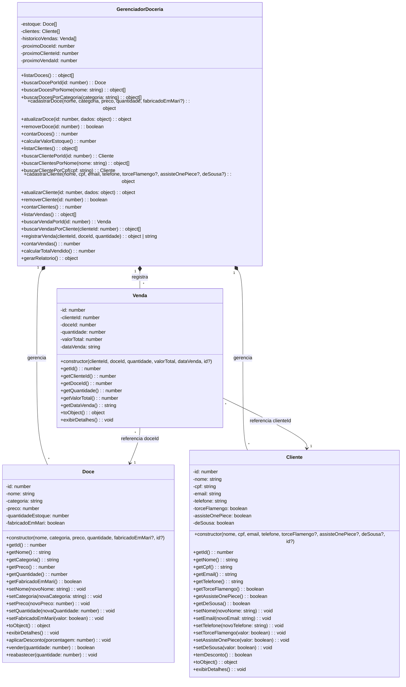

# Doceria Gourmet

Sistema web para gerenciamento de uma doceria. Permite cadastrar doces, clientes e registrar vendas, com relatorios de estoque, clientes e vendas.

**Stack:** Next.js 16 + React 19 + TypeScript + Tailwind CSS 4 + shadcn/ui

---

## Como Executar

Veja o guia completo em [`docs/public/COMO-RODAR.md`](docs/public/COMO-RODAR.md).

Resumo rapido:

```bash
npm install
npm run dev
# acesse http://localhost:3303
```

---

## Estrutura de Pastas

```text
src/
├── models/                        # Entidades OOP
│   ├── Doce.ts                    # 6 atributos, 16 metodos
│   ├── Cliente.ts                 # 8 atributos, 17 metodos
│   └── Venda.ts                   # 6 atributos, 8 metodos
├── services/
│   └── GerenciadorDoceria.ts      # 24 metodos, gerencia todo o CRUD
├── lib/
│   ├── dados.ts                   # Singleton do gerenciador (globalThis)
│   ├── types.ts                   # Interfaces TypeScript
│   └── utils.ts                   # Funcao cn() para classes CSS
├── app/
│   ├── api/                       # 7 endpoints REST
│   │   ├── doces/route.ts         # GET + POST
│   │   ├── doces/[id]/route.ts    # GET + PUT + DELETE
│   │   ├── clientes/route.ts      # GET + POST
│   │   ├── clientes/[id]/route.ts # GET + PUT + DELETE
│   │   ├── vendas/route.ts        # GET + POST
│   │   └── relatorio/route.ts     # GET
│   ├── page.tsx                   # Home (Dashboard)
│   ├── doces/page.tsx             # Pagina de Doces
│   ├── clientes/page.tsx          # Pagina de Clientes
│   ├── vendas/page.tsx            # Pagina de Vendas
│   ├── relatorios/page.tsx        # Pagina de Relatorios
│   ├── layout.tsx                 # Layout raiz
│   └── globals.css                # Tema rosa/pink
├── components/
│   ├── AppLayout.tsx              # Wrapper com sidebar
│   ├── AppSidebar.tsx             # Menu lateral de navegacao
│   └── ui/                        # 16 componentes shadcn/ui
└── hooks/
    └── use-mobile.ts              # Detecta tela mobile
```

---

## Paginas

| Pagina | Rota | Funcionalidade |
|--------|------|----------------|
| Inicio | `/` | Dashboard com cards de resumo + valor em estoque |
| Doces | `/doces` | CRUD completo com pesquisa, modal e detalhes |
| Clientes | `/clientes` | CRUD completo com checkboxes de desconto |
| Vendas | `/vendas` | Registrar vendas e ver historico |
| Relatorios | `/relatorios` | 3 secoes: Estoque, Clientes e Vendas |

---

## Diagrama de Classes UML

Documentacao completa com legenda e contagens em [`docs/public/DIAGRAMA-UML.md`](docs/public/DIAGRAMA-UML.md).



---

## Documentacao

| Documento | Caminho | Descricao |
|-----------|---------|-----------|
| Como Rodar | [`docs/public/COMO-RODAR.md`](docs/public/COMO-RODAR.md) | Guia para subir o projeto localmente |
| Estado Atual | [`docs/public/ESTADO-ATUAL.md`](docs/public/ESTADO-ATUAL.md) | Visao geral atualizada do sistema |
| Diagrama UML | [`docs/public/DIAGRAMA-UML.md`](docs/public/DIAGRAMA-UML.md) | Diagrama de classes com legenda e contagens |
| Changelogs | [`docs/public/changelog/`](docs/public/changelog/) | Historico de mudancas |
