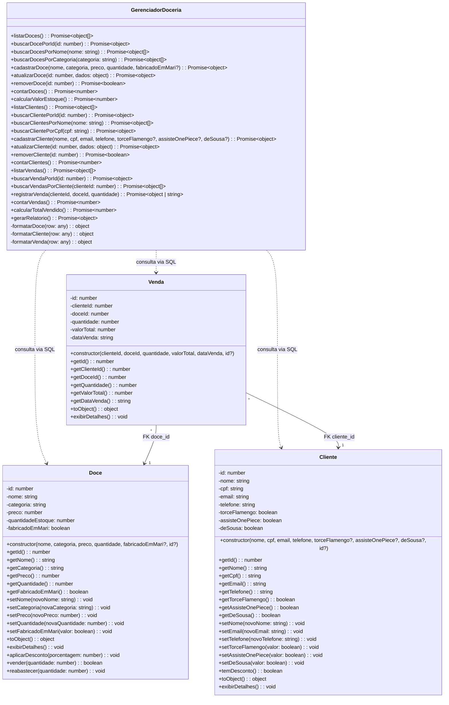

# Diagrama de Classes UML — Doceria Gourmet

> Diagrama atualizado com o estado atual do codigo. Sempre que uma classe mudar (novo atributo, novo metodo), atualizar aqui.

---

## Diagrama

---

## Legenda

| Simbolo | Significado |
|---------|-------------|
| `-` | Atributo/metodo `private` |
| `+` | Metodo `public` |
| `..>` | Dependencia (GerenciadorDoceria consulta as tabelas via SQL) |
| `-->` | Associacao/FK (Venda referencia por ID) |

---

## Contagem de Membros

| Classe | Atributos | Metodos | Total |
|--------|-----------|---------|-------|
| Doce | 6 | 16 | 22 |
| Cliente | 8 | 17 | 25 |
| Venda | 6 | 8 | 14 |
| GerenciadorDoceria | 0 | 27 (24 publicos + 3 privados) | 27 |
| **Total** | **20** | **68** | **88** |

> **Nota:** O GerenciadorDoceria nao tem mais atributos (arrays/contadores). Os dados agora ficam no PostgreSQL. Os 3 metodos privados (`formatarDoce`, `formatarCliente`, `formatarVenda`) fazem o mapeamento `snake_case` → `camelCase`.

---

## Relacionamentos

| Relacao | Tipo | Descricao |
|---------|------|-----------|
| GerenciadorDoceria → Doce | Dependencia | O gerenciador consulta a tabela `doces` via SQL |
| GerenciadorDoceria → Cliente | Dependencia | O gerenciador consulta a tabela `clientes` via SQL |
| GerenciadorDoceria → Venda | Dependencia | O gerenciador consulta a tabela `vendas` via SQL |
| Venda → Cliente | FK (N:1) | `cliente_id` referencia `clientes(id)` com ON DELETE RESTRICT |
| Venda → Doce | FK (N:1) | `doce_id` referencia `doces(id)` com ON DELETE RESTRICT |
