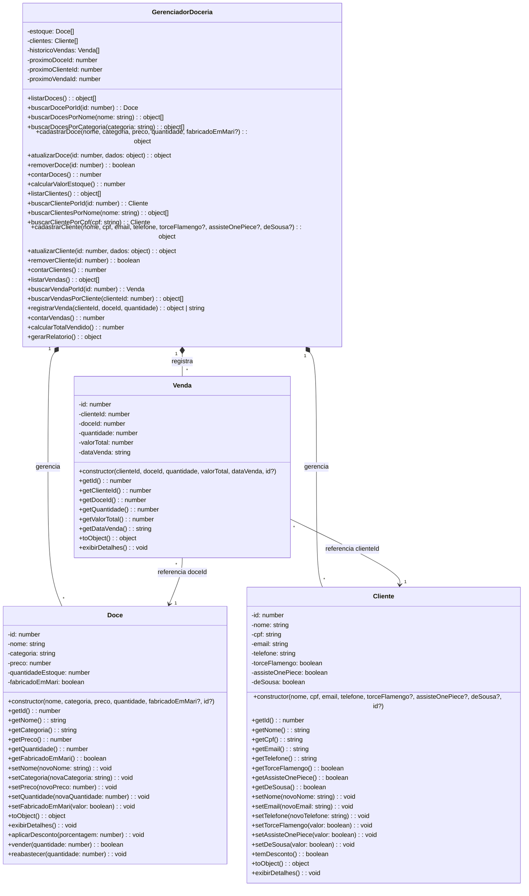

# Diagrama de Classes UML — Doceria Gourmet

> Diagrama atualizado com o estado atual do codigo. Sempre que uma classe mudar (novo atributo, novo metodo), atualizar aqui.

---

## Diagrama

---

## Legenda

| Simbolo | Significado |
|---------|-------------|
| `-` | Atributo `private` |
| `+` | Metodo `public` |
| `*--` | Composicao (o GerenciadorDoceria contem e gerencia o ciclo de vida) |
| `-->` | Associacao (Venda referencia por ID, sem posse) |

---

## Contagem de Membros

| Classe | Atributos | Metodos | Total |
|--------|-----------|---------|-------|
| Doce | 6 | 16 | 22 |
| Cliente | 8 | 17 | 25 |
| Venda | 6 | 8 | 14 |
| GerenciadorDoceria | 6 | 24 | 30 |
| **Total** | **26** | **65** | **91** |

---

## Relacionamentos

| Relacao | Tipo | Descricao |
|---------|------|-----------|
| GerenciadorDoceria → Doce | Composicao (1:N) | O gerenciador contem e controla o ciclo de vida dos doces |
| GerenciadorDoceria → Cliente | Composicao (1:N) | O gerenciador contem e controla o ciclo de vida dos clientes |
| GerenciadorDoceria → Venda | Composicao (1:N) | O gerenciador contem e controla o ciclo de vida das vendas |
| Venda → Cliente | Associacao (N:1) | Cada venda referencia um cliente pelo `clienteId` |
| Venda → Doce | Associacao (N:1) | Cada venda referencia um doce pelo `doceId` |
